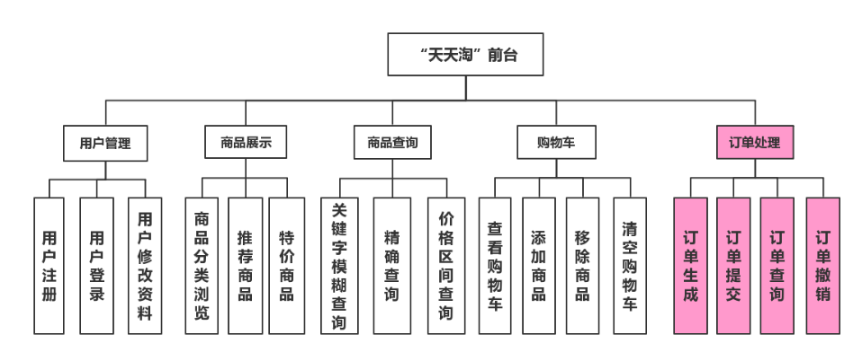
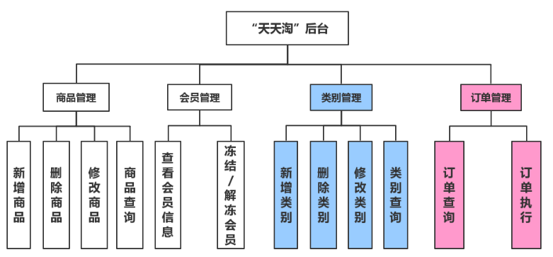

# JavaWeb--天天淘网上商城

### 项目介绍

> 系统采用Model2模式，使用JSP生成表现层内容；使用Servlet作为控制器，接收客户请求，收集数据，实现业务层逻辑调用，并选择恰当视图对客户做出响应；使用JavaBean充当模型，用于数据的存储与提取。 

* 前台功能

  

* 后台功能

  

**功能包括：登录注册，验证码，过滤器拦截，商品增删改查，模糊查询，条件查询，用户资料管理，会员管理，分页查询……**