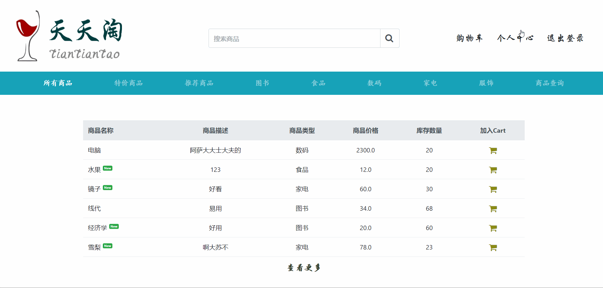
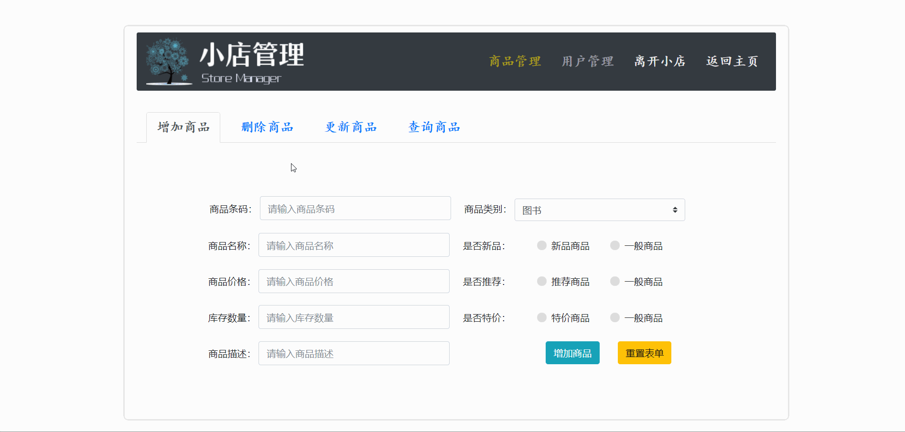
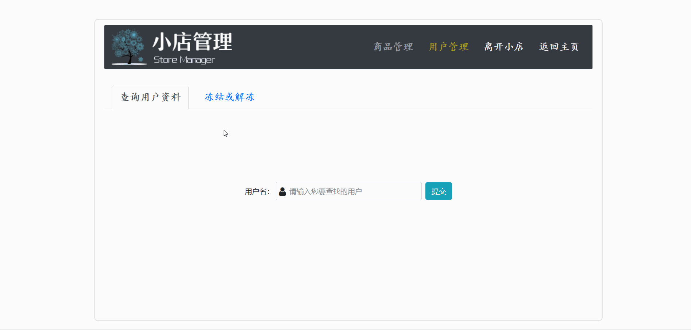

# JavaWeb--天天淘网上商城

## 项目介绍

> **系统采用Model2模式，使用JSP生成表现层内容；使用Servlet作为控制器，接收客户请求，收集数据，实现业务层逻辑调用，并选择恰当视图对客户做出响应；使用JavaBean充当模型，用于数据的存储与提取。** 

### 1. 项目功能

* **前台功能**

  

* **后台功能**

  

* **其他功能**

  1. **系统通过过滤器实现用户登录与否的验证，除了浏览商品外，其他操作都在用户登录的前提下才能进行**
  2. **实现通过验证码来验证用户登录**
  3. **商品展示实现分页展示**
  4. **数据库连接采用数据库连接池技术**
  5. **采用Model2开发模式**

### 2. 数据库设计

**表1. ttt_goodsinfo （商品信息表，ttt即“天天淘”的缩写）**

| 字段名      | 数据类型    | 是否为空 | 是否主键 | 描述                                                 |
| ----------- | ----------- | -------- | -------- | ---------------------------------------------------- |
| id          | INT(10)     | N        | Y        | 系统自动编号                                         |
| name        | VARCHAR(50) | N        |          | 商品名称                                             |
| description | TEXT        | Y        |          | 商品描述                                             |
| category    | ENUM        | Y        |          | 商品分类（如果有类别管理的此处应为分类号关联分类表） |
| price       | MONEY(8)    | Y        |          | 价格                                                 |
| isNew       | TINYINT(1)  | N        |          | 是否为新品                                           |
| commend     | TINYINT(1)  | Y        |          | 是否推荐                                             |
| discount    | TINYINT(1)  | Y        |          | 是否特价商品                                         |
| stock       | INT(5)      | N        |          | 商品库存                                             |

**表2.ttt_userinfo（用户信息表）**

| 字段名   | 数据类型     | 是否为空 | 是否主键 | 描述         |
| -------- | ------------ | -------- | -------- | ------------ |
| id       | INT(10)      | N        | Y        | 系统自动编号 |
| name     | VARCHAR(50)  | N        |          | 用户名       |
| password | VARCHAR(50)  | N        |          | 用户密码     |
| address  | VARCHAR(200) | N        |          | 地址         |
| mobile   | VARCHAR(11)  | N        |          | 电话         |
| email    | VARCHAR(50)  | N        |          | 邮箱         |
| status   | TINYINT(1)   | N        |          | 是否冻结     |

**表3.ttt_manager（管理员表）**

| 字段名   | 数据类型    | 是否为空 | 是否主键 | 描述         |
| -------- | ----------- | -------- | -------- | ------------ |
| id       | INT(10)     | N        | Y        | 系统自动编号 |
| name     | VARCHAR(50) | N        |          | 用户名       |
| password | VARCHAR(50) | N        |          | 用户密码     |

### 3. 开发环境

- **操作系统**：Windows 10
- **IDE工具**：Eclipse 

- **JDK**：JDK1.8
- **中间件**：Tomcat
- **数据库**：MySQL5.7
- **后端技术**：Java、Jsp、Servlet
- **前端技术**：Html、css、JavaScript、Jquery、Bootstrap

## 项目效果

**登录注册**

**个人中心**

**商品查询**

**分页**

**购物**

**管理员**

**商品管理**

**用户管理**

